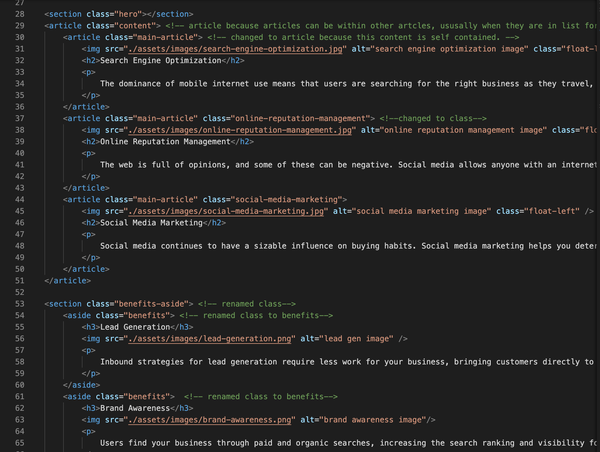

# Refactor-HW

In this refactor homework I made changes to this HTML file that include:

* changing 
 tags to appropriet semantic tags.
* renamed, consolidated CSS classes and ommitted duplicate classes.
* added appropriet alt attributes to image links.
* re-organized structure of HTML.
* added comments to HTML and CSS.

 ## ScreenShot Example

